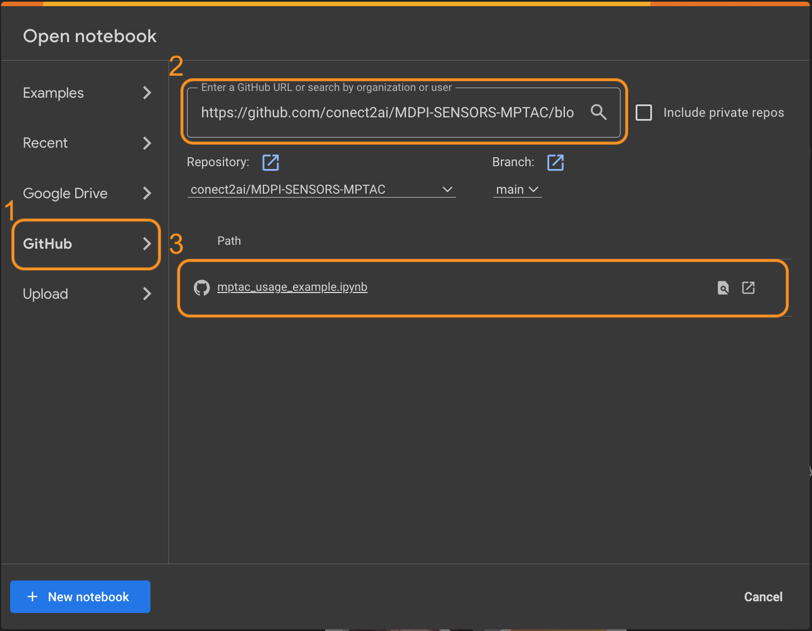

<p align="center">
  
</p> 

# An Evolutionary Multivariate Time Series Compression Algorithm for IoT Applications

### ✍🏾Authors: [Hagi Jakobson](https://github.com/hagijakobson), [Marianne Silva](https://github.com/MarianneDiniz), [Ignacio Sánchez-Gendriz](https://github.com/name), [Carlos M. D. Viegas](https://github.com/cmdviegas), [Ivanovitch Silva](https://github.com/ivanovitchm).

# 1. Abstract/Overview

The Internet of Things (IoT) is transforming how devices interact and share data, especially in areas like vehicle monitoring. However, transmitting large volumes of real-time data can result in high latency and substantial energy consumption. In this context, Tiny Machine Learning (TinyML) emerges as a promising solution, enabling the execution of machine learning models on resource-constrained embedded devices. This paper aims to develop two online multivariate compression approaches specifically designed for TinyML, utilizing the Typicality and Eccentricity Data Analytics (TEDA) framework. The proposed approaches are based on data eccentricity and do not require predefined mathematical models or assumptions about data distribution, thereby optimizing compression performance. The methodology involves applying the approaches to a case study using the OBD-II Freematics ONE+ dataset, which is focused on vehicle monitoring. Results indicate that both proposed approaches, whether parallel or sequential compression, show significant improvements in execution time and compression errors. These findings highlight the approach's potential to enhance the performance of embedded IoT systems, thereby improving the efficiency and sustainability of vehicular applications.

# 2. Environment Setup

This section contains the steps to execute the code in this repository both on Google Colaboratory and localy.

## Running on Google Colaboratory

1. First, open [Google Colab](https://colab.research.google.com/) in another tab

2. Follow the next three steps

- 2.1. Select `Github` tab
- 2.2. Paste the link of the notebook: `https://github.com/conect2ai/MDPI-SENSORS-MPTAC/blob/main/mptac_usage_example.ipynb`
- 2.3. Select the Jupyter notebook: `mptac_usage_example.ipynb`

<p align="center">
  
</p> 

## Running localy
1. Clone this repository:
  ```bash
  git clone https://github.com/conect2ai/IEEE-SENSORS-MPTAC.git
  ```
2. Change to the repository directory:
  ```bash
  cd IEEE-SENSORS-MPTAC
  ```

3. Create a virtual environment:

- If you have Anaconda installed:
  ```bash
  conda create --name mptac python==3.9
  ```
  Activate the virtual environment:
  ```bash
  conda activate mptac
  ```
- If you don't have Anaconda installed, use venv:
  ```bash
  python3 -m venv mptac
  ```
  Activate the virtual environment:
    - On Windows
      ```bash
      mptac\Scripts\activate
      ```
    - On macOS/Linux:
      ```
      source mptac/bin/activate
      ```
4. Install the requirements:
```bash
pip install -r requirements.txt
```

5. Execute the [mptac_usage_example.ipynb](./mptac_usage_example.ipynb) file.

# License

This project is licensed under the MIT License - see the [LICENSE](LICENSE) file for details.

# About us

The research group [**Conect2AI**](http://conect2ai.dca.ufrn.br) consists of undergraduate and graduate students from the Federal University of Rio Grande do Norte (UFRN) and aims to apply Artificial Intelligence (AI) and machine learning in emerging fields. Our expertise includes Embedded Intelligence and IoT, optimizing resource management and energy efficiency, contributing to sustainable cities. In energy transition and mobility, we apply AI to optimize energy use in connected vehicles and promote more sustainable mobility.